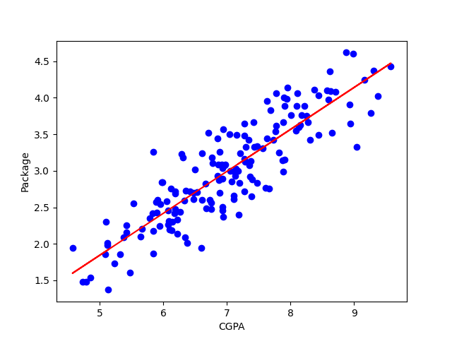

# Predicting Placement Packages with Linear Regression

I made a Simple Linear Regression model to predict placement packages (LPA) from CGPA using `placement.csv`. Students and young professionals often wonder how academic performance like CGPA impacts career outcomes such as placement packages. This project explores that relationship using machine learning, providing actionable insights to help with career planning and demonstrating the value of data-driven models in real-world scenarios.

## How It Works

**Dataset:**  "placement.csv" with 200 entries, featuring CGPA (independent variable) and package in LPA (dependent variable).

**Approach:**  Performed data exploration (histograms, KDE for distributions), preprocessing (checked nulls, stats, outliers), model training with Simple Linear Regression from scikit-learn, and evaluation with metrics and visualizations.

**Tools:**  Python, pandas for data handling, scikit-learn for modeling, matplotlib/seaborn for plot.

## What I Achieved
**Results:** The model achieves an R² score of 0.77 (explaining 77% of variance), MAE of 0.23 (average error ~0.23 LPA), and RMSE of 0.29, showing strong predictive performance for such a simple setup.

**Insights:** CGPA is a robust predictor, but incorporating factors like internships could enhance accuracy, opening doors for more advanced ML applications.

**Visualization:** CGPA vs. Placement Package

  

## Setup

1. Clone the repo: git clone https://github.com/yourusername/ML-Regression-PlacementPrediction-Project1.git
2. Install dependencies: pip install -r requirements.txt
3. Open CGPA_Package_Prediction.ipynb in Jupyter to run and explore the model.

## 🤝Connect for Collaboration
Open to discussions on ML, tech innovations, or joint projects — let's build something impactful!

- <a href="https://www.linkedin.com/in/zain-shah-871aa532a">
     LinkedIn
  </a>

- <a href="https://x.com/zainshah_x">
     Twitter (X)
  </a>

- <a href="mailto:btenmeten12345@gmail.com">
     Gmail
  </a>

Star if useful, and check my profile for more projects!
